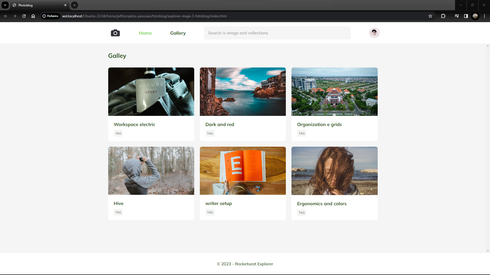

## 💻 Project Photo Blog

  

## About  Project

- This project was developed during Stage 03 classes at Explorer. A gallery interface that instantly updates different images when the page is reloaded, where all transitions and image saturation have been customized.

## 🚀 Technologies

This project was developed with the following technologies:

- HTML
- CSS
- GIT
- GITHUB
- FIGMA

## 📲 Contacts 

- 📩 email: jeffdsilva.29@gmail.com
- 👤 linkedin: https://www.linkedin.com/in/jefferson-silva/
